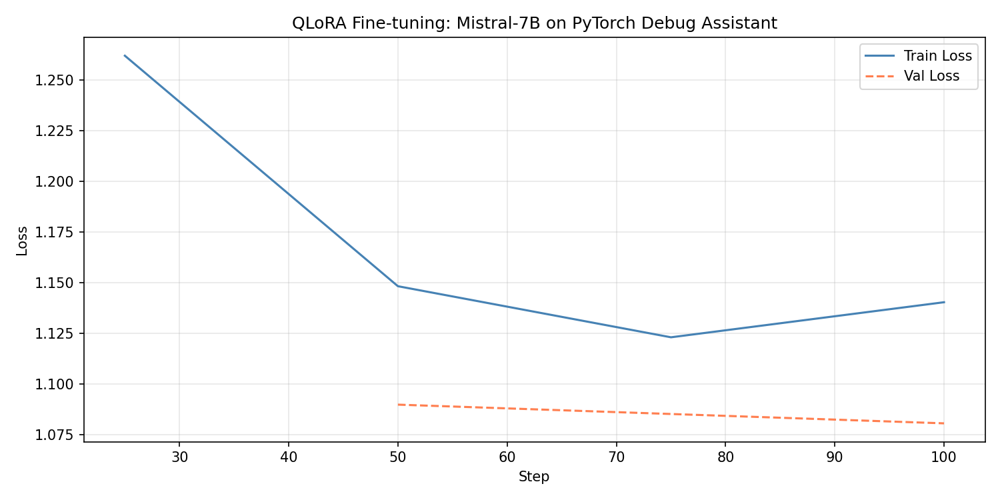

# pytorch-debug-assistant

I got tired of copy-pasting PyTorch errors into ChatGPT during late-night 
training runs, so I fine-tuned a small model to do it faster and offline.

This is a QLoRA fine-tune of Phi-3-mini-4k-instruct on ~1,500 PyTorch 
Stack Overflow Q&A pairs. It's not magic — it won't replace reading the 
docs — but it's pretty good at the errors you hit over and over.

## what it does

Paste in a PyTorch error or a description of what's going wrong. It gives 
you a plain-English explanation of the root cause and a code fix.

## how it was built

**Dataset** — scraped ~2,500 PyTorch questions from Stack Overflow, kept 
only answered ones with decent upvotes, cleaned the HTML, and formatted 
them as instruction-tuning pairs. Published at 
`zehansunesara/pytorch-debug-assistant` on HuggingFace.

**Fine-tuning** — QLoRA (4-bit, r=16) on top of Phi-3-mini-4k-instruct, 
trained on a T4 GPU via Google Colab. Only ~1-2% of parameters actually 
update during training, which is the whole point of LoRA.

**Serving** — FastAPI backend, Gradio frontend, Docker for local runs. 
Live demo on HuggingFace Spaces.

## usage

```python
from transformers import AutoModelForCausalLM, AutoTokenizer
from peft import PeftModel

base = AutoModelForCausalLM.from_pretrained("microsoft/Phi-3-mini-4k-instruct")
model = PeftModel.from_pretrained(base, "zehansunesara/pytorch-debug-assistant-phi3-mini")
```

Or just use the [live demo](#) (link coming after Phase 3).

## running locally

```bash
git clone https://github.com/usazehan/pytorch-debug-assistant
cd pytorch-debug-assistant
cp .env-example .env  # fill in your tokens
pip install -r requirements.txt
```

## project structure
scripts/          data collection + cleaning pipeline
notebooks/        QLoRA fine-tuning (Colab)
data/processed/   formatted dataset (also on HuggingFace)

## training results

100 steps on a T4 GPU. Loss dropped fast in the first 50 steps then 
leveled off — pretty typical for a small dataset with a narrow domain.



Not fully converged, but good enough to give correct answers on the 
errors it was trained on. Planning a longer 500-step run on the 
cleaned dataset next.

## what's next

- [ ] Post-training quantization (GPTQ/AWQ) + latency benchmarks  
- [ ] FastAPI + Gradio serving layer  
- [ ] HuggingFace Spaces deployment  
- [ ] OSS contribution to 🤗 PEFT